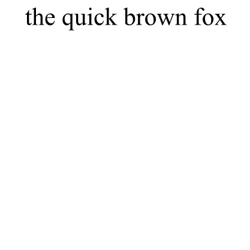

# 在PDF上直接绘制文本

最近忙于工作和一些杂事，文章没怎么写。
我以前提到过，在PDF中嵌入字体，它既可能是一件很简单的事，但同时也可能是很难的一件事。
不过，如果将文字的曲线直接在PDF中绘制出来，那就是一件再简单不能的工作了。

读过*PDF Explained*一书的人大概知道它有一章是讲PDF在绘制页面时候所使用的操作符的。
不过，那个书的例子还需要手动或者用工具来修object的offset的。
**这就不优雅**。之所以说不优雅，是对于初学者来讲，这例子还可以做得更简单些，更关注绘制本身。

如果使用PyMuPDF，就可以做出这样的例子：
```Python
import pymupdf

doc = pymupdf.open()
page = doc.new_page(width=100, height=100)
page_xref = page.xref
content_xref = doc.get_new_xref()
doc.update_object(content_xref, "<<>>")
op_test = [
    b"1 0 0 RG 1 w 10 10 m 90 90 l S",
    b"0 0 1 RG 1 w 10 10 m 50 10 50 90 90 90 c S"
]
doc.update_stream(content_xref, b"\n".join(op_test))
doc.xref_set_key(page_xref, "Contents", f"{content_xref} 0 R")
doc.save("z.pdf")
```

效果如下：


当然，熟悉PyMuPDF的可能会知道，使用其API绘制，坐标原点在页面的左上角。而上面这种直接写绘制指令的做法，是以左下角为坐标原点的。PyMuPDF之所以选择左上角……可能还是以左上角为原点的绘制设备比较多。当然了，反映到PDF中，就是做了一个坐标变换罢了。

那么接下来，就要看看怎么在PDF中画字了。为了绘制更简便，下面PDF绘制的工具需要换成Cairo。

虽然不需要在PDF中嵌入字体，但是肯定需要获取字体的曲线信息，然后将之转换成PDF中的绘制指令。

那么，就需要使用freetype了。那么，在Python，安装这两个库，就需要使用命令（macOS需要编译）：
```
pip install freetype-py pycairo
```

那么在Cairo中画PDF，可以这么做：
```Python
import cairo

with cairo.PDFSurface("z.pdf", 100, 100) as surface:
    context = cairo.Context(surface)
    context.set_line_width(1)
    context.set_source_rgb(1, 0, 0)
    context.move_to(10, 10)
    context.line_to(90, 90)
    context.stroke()
    context.set_source_rgb(0, 0, 1)
    context.move_to(10, 10)
    context.curve_to(50, 10, 50, 90, 90, 90)
    context.stroke()
```

结果是这样的：


那么，接下来，我们就要画一画字了。为了方便，我们直接使用freetype的`decompose`函数。
```Python
import cairo
import freetype
import pathlib

def apply_one(a, b, c):
    b1 = (a + 2 * b) / 3
    b2 = (c + 2 * b) / 3
    return b1, b2

def conic_to_cubic(x0, y0, x1, y1, x2, y2):
    c1_x, c2_x = apply_one(x0, x1, x2)
    c1_y, c2_y = apply_one(y0, y1, y2)
    return c1_x, c1_y, c2_x, c2_y

def line_to(to, context):
    context.line_to(to.x, to.y)

def move_to(to, context):
    context.move_to(to.x, to.y)

def conic_to(cp, to, context):
    cur_x, cur_y = context.get_current_point()
    c1_x, c1_y, c2_x, c2_y = conic_to_cubic(cur_x, cur_y, cp.x, cp.y, to.x, to.y)
    context.curve_to(c1_x, c1_y, c2_x, c2_y, to.x, to.y)

def cubic_to(c1, c2, to, context):
    context.curve_to(c1.x, c1.y, c2.x, c2.y, to.x, to.y)

def draw_char(context, face, char):
    face.load_char(char)
    outline = face.glyph.outline
    outline.decompose(context, move_to, line_to, conic_to, cubic_to)

def draw_text(context, face, size, x, y, text):
    cur_x = x
    cur_y = y
    factor = 1 / face.units_per_EM * size
    for char in text:
        context.save()
        context.transform(cairo.Matrix(factor, 0, 0, -factor, cur_x, cur_y))
        draw_char(context, face, char)
        context.fill()
        context.restore()
        cur_x += face.glyph.metrics.horiAdvance * factor
```
这里面有个二次贝塞尔曲线转三次的函数，至于怎么来的，那就随便找个图形学的书看一看就知道了。

我们追加几行：
```Python
def main():
    p = pathlib.Path(__file__)
    with cairo.PDFSurface(f"{p.stem}.pdf", 100, 100) as surface:
        context = cairo.Context(surface)
        face = freetype.Face("C:\\Windows\\Fonts\\times.ttf")
        draw_text(context, face, 10, 10, 10, "the quick brown fox")

if __name__ == "__main__":
    main()
```

那么运行就能得到结果：


那么，如果我们想要上一点强度，来绘制一点阿拉伯语怎么办呢？作为一个API Man，可以用uharfbuzz嘛。

追加及变更代码：
```Python
import uharfbuzz
def draw_glyph(context, face, glyph):
    face.load_glyph(glyph)
    outline = face.glyph.outline
    outline.decompose(context, move_to, line_to, conic_to, cubic_to)

def build_glyph_list(face, text):
    font = uharfbuzz.Font(face)
    buffer = uharfbuzz.Buffer()
    buffer.add_str(text)
    buffer.guess_segment_properties()
    uharfbuzz.shape(font, buffer, {"kern": True, "liga": True})
    infos = buffer.glyph_infos
    positions = buffer.glyph_positions
    data = []
    for info, pos in zip(infos, positions):
        g = info.codepoint
        h = pos.x_advance
        v = pos.y_advance
        x = pos.x_offset
        y = pos.y_offset
        data.append((g, h, v, x, y))
    return data

def draw_text2(context, face1, face2, size, x, y, text):
    cur_x = x
    cur_y = y
    factor = 1 / face1.units_per_EM * size
    for g, h, v, x_off, y_off in build_glyph_list(face2, text):
        context.save()
        delta_x = x_off * factor
        delta_y = -y_off * factor
        context.transform(cairo.Matrix(factor, 0, 0, -factor, cur_x + delta_x, cur_y + delta_y))
        draw_glyph(context, face1, g)
        context.fill()
        context.restore()
        cur_x += h * factor
        cur_y += v * factor

def main():
    p = pathlib.Path(__file__)
    with cairo.PDFSurface(f"{p.stem}.pdf", 100, 100) as surface:
        context = cairo.Context(surface)
        face = freetype.Face("C:\\Windows\\Fonts\\times.ttf")
        draw_text(context, face, 10, 10, 10, "the quick brown fox")
        blob = uharfbuzz.Blob.from_file_path("C:\\Windows\\Fonts\\times.ttf")
        face2 = uharfbuzz.Face(blob)
        text = "\u0627\u0644\u0639\u064e\u0631\u064e\u0628\u0650\u064a\u064e\u0651\u0629"
        draw_text2(context, face, face2, 10, 10, 25, text)
```

那么效果如：


那么文字绘制，基本上就可以结束了。基于此，读者可自行实现bidirectional和line break算法。大约三五天就能够实现一个简易的排版软件了。

如果稍加扩展，比如增加一个markdown前端，读者就得到了属于自己的文档语言了。
