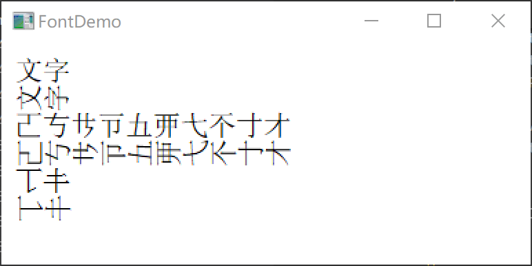
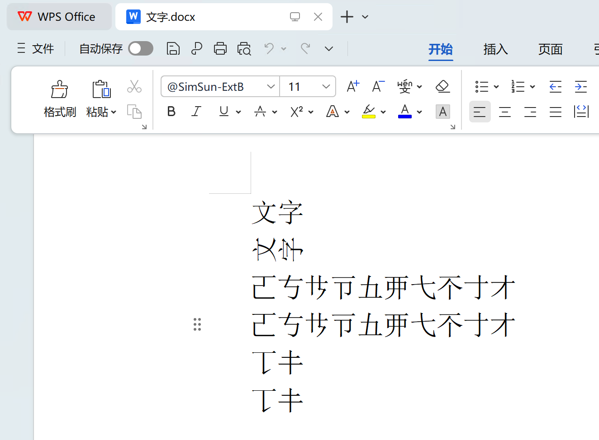
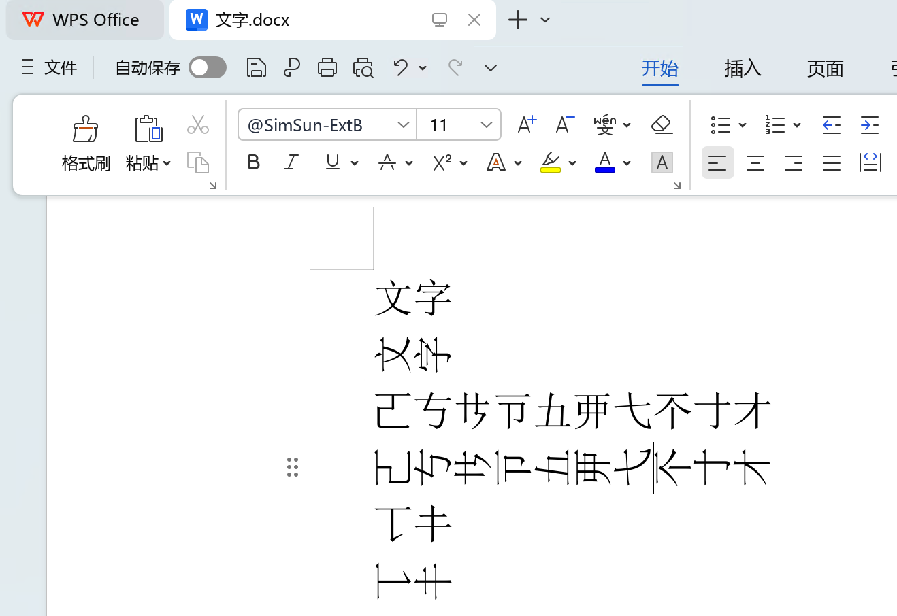
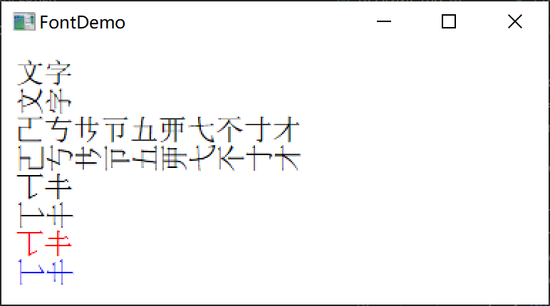

# @的玩法

我们在很多社交平台以及软件上，时常会被人“at”。具体到操作上，那就是在输入“@XXX”的文本。随后网站页面或者软件进行计算，生成一个具有链接性的东西。

而谈到排版，尤其是Windows系统编程，就知道在字体使用上，是有一个@秘技的。比如说，我们使用一个简易的Windows程序代码（[下载测试](20260503-test-font.py)）：
```Python
import sys
import win32gui
import win32con
import win32api

def draw_text_with_font(hdc, font, text, x_pos, y_pos):
    logfont = win32gui.LOGFONT()
    logfont.lfFaceName = font
    logfont.lfHeight = 20
    logfont.lfQuality = win32con.CLEARTYPE_QUALITY
    hf = win32gui.CreateFontIndirect(logfont)
    win32gui.SelectObject(hdc, hf)
    win32gui.DrawText(
        hdc, text, -1, (x_pos, y_pos, x_pos + 200, y_pos + 20),
        win32con.DT_LEFT | win32con.DT_TOP | win32con.DT_SINGLELINE
    )

def wnd_proc(hwnd, message, wparam, lparam):
    if message == win32con.WM_CREATE:
        hdc = win32gui.GetDC(hwnd)
        win32gui.ReleaseDC(hwnd, hdc)
        return 0
    elif message == win32con.WM_PAINT:
        hdc, paintStruct = win32gui.BeginPaint(hwnd)
        win32gui.SetTextColor(hdc, win32api.RGB(0, 0, 0))
        win32gui.SetBkMode(hdc, win32con.TRANSPARENT)
        draw_text_with_font(hdc, "SimSun", "文字", 10, 10)
        draw_text_with_font(hdc, "@SimSun", "文字", 10, 30)
        draw_text_with_font(hdc, "SimSun-ExtB", "𠀀𠀁𪜀𪜁𫝀𫝁𫠠𫠡𬺰𬺱", 10, 50)
        draw_text_with_font(hdc, "@SimSun-ExtB", "𠀀𠀁𪜀𪜁𫝀𫝁𫠠𫠡𬺰𬺱", 10, 70)
        draw_text_with_font(hdc, "SimSun-ExtG", "𰀀𰀁", 10, 90)
        draw_text_with_font(hdc, "@SimSun-ExtG", "𰀀𰀁", 10, 110)
        win32gui.EndPaint(hwnd, paintStruct)
        return 0
    elif message == win32con.WM_DESTROY:
        win32gui.PostQuitMessage(0)
        return 0

    return win32gui.DefWindowProc(hwnd, message, wparam, lparam)

def main():
    instance = win32api.GetModuleHandle(None)
    app_name = "FontDemo"

    wnd = win32gui.WNDCLASS()
    wnd.style = win32con.CS_HREDRAW | win32con.CS_VREDRAW
    wnd.hInstance = instance
    wnd.lpszClassName = app_name
    wnd.lpfnWndProc = wnd_proc
    wnd.hCursor = win32gui.LoadCursor(0, win32con.IDC_ARROW)
    wnd.hIcon = win32gui.LoadIcon(0, win32con.IDI_APPLICATION)
    wnd.hbrBackground = win32con.COLOR_WINDOW + 1
    wnd_id = win32gui.RegisterClass(wnd)

    if not wnd_id:
        win32gui.MessageBox(
            None, "This program requirs Windows NT!",
            app_name, win32con.MB_ICONERROR
        )
        return 0

    window = win32gui.CreateWindow(
        wnd_id, app_name,
        win32con.WS_OVERLAPPEDWINDOW,
        win32con.CW_USEDEFAULT, win32con.CW_USEDEFAULT,
        400, 200, 0, 0, instance, None
    )

    win32gui.ShowWindow(window, win32con.SW_SHOWNORMAL)
    win32gui.UpdateWindow(window)

    while True:
        hwnd, msg = win32gui.GetMessage(None, 0, 0)
        if hwnd <= 0:
            break
        else:
            win32gui.TranslateMessage(msg)
            win32gui.DispatchMessage(msg)

    sys.exit(msg[1])

if __name__ == "__main__":
    main()
```
效果如下：



这个用法在Word中依然成立。如：

<!--  -->
图

# WPS里的瓜

我这篇文章要谈什么呢？谈WPS的竖排。长期以来，我一直觉得WPS的汉字处理做的应该是很专业的。注意，我的态度是“应该是”。而具体是不是，我其实是没完全测过的。是因为我不能做么？我相信我的读者对我的水平应该还是有点了解的。我长期以来的态度是：不觉得有必要做。

我们在WPS里面使用这个@秘技输入一般的文本，大多都还是正常的。但如果我们输入一些“生僻字”，比如Unicode中汉字扩展区的字。那么效果大致上是如下的：



是不是很出乎意料？这并不是我的发现，而是来自用户反馈。在经过两周的排查之后，我才查到了问题所在。在讨论问题之前。我们来聊一聊Unicode。我们刚才提到了“生僻字”。从学理上来说，所谓“生僻字”并不存在严格的定义，甚至是基于每个人的主观认识而完全不一样的。所以一些技术专家不会用这个概念。而从Unicode上说，汉字区的字，都是平等的，他们只有来源不同，以及历史上的使用频度的差异。就排版软件而已，对待这些汉字区的字，态度也应该是平等的。

# 分析

我们还得要来问一问：WPS的所有版本在处理这个场景的时候，都是错的么？并不是，如果我们使用Linux版本，那么效果是正常的。这就引发了我初步的猜测：使用FreeType的结构是对的。那么……我就来给你们介绍一个Windows版本的WPS秘技：渲染引擎切换。我们先找到32位的wps.exe的所在文件夹，打开qt.conf之后，加入两行代码：
```ini
[Platforms]
WindowsArguments = fontengine=freetype
```

那么，重启WPS之后，就会发现WPS的效果也对了。



当我发现这个行为之后，调试重点就是GDI了。在追踪了大量的代码之后，最终定位到Qt中的QFont绘制的代码。如果要说结论的话，那就一句话，用了不太对的字体配置方法和行为不太可靠的的API。

这个字体配置方法就是指@信息如何传递到WPS内部。而行为不太可靠的API则是Windows的GDI中的ExtTextOut。这个不太可靠其实指的是UB，undefined behavior。我们回到上面的Python代码，我们可以这么玩（[下载测试](20260503-test-font-exttextout.py)）：
```Python
        draw_text_with_font(hdc, "@SimSun-ExtG", "𰀀𰀁", 10, 110)
        logfont = win32gui.LOGFONT()
        logfont.lfFaceName = "@SimSun-ExtG"
        logfont.lfHeight = 20
        logfont.lfQuality = win32con.CLEARTYPE_QUALITY
        hf = win32gui.CreateFontIndirect(logfont)
        win32gui.SelectObject(hdc, hf)
        win32gui.SetTextColor(hdc, win32api.RGB(255, 0, 0))
        win32gui.ExtTextOut(hdc, 10, 130, 0x10, None, chr(98) + chr(99), None)
        win32gui.SetTextColor(hdc, win32api.RGB(0, 0, 255))
        win32gui.ExtTextOut(hdc, 10, 150, 0, None, "𰀀𰀁", None)
        win32gui.EndPaint(hwnd, paintStruct)
```

重新执行就能发现问题所在了。效果如下：



这个UB在GDI文档中并未提及，而WPS的这部分代码的测试覆盖度不高，最终让用户创造的很平凡的例子给测出来了。一般来说，数学上“平凡”的东西，可能并不简单。但是在软件中，测试例子的完备性取决于程序员的脑子中的场景是不是完全。

我有时候就很感慨，WPS的一些小毛病，背后可能是大毛病的体现。用户没拿着刀砍过来，也是脾气好。WPS的核心价值就是为用户创造价值。就我所涉及的领域，我实在讲，还有很多事情要做。要说我有没有急躁，我也是有的，很多简单的问题就这么一直堆积的，时间和投入的人力太不足了。

# Qt

我们大概知道WPS是很庞大的Qt程序。那么它用的Qt是不是公版的Qt呢？并不是。WPS的Qt目前已经锁死在版本5。里面有大量的更改用来适应WPS的一些绘制工作。

我们今天讲到的这个问题，是QFont中的。那么除了@有问题之外，还有没有别的问题呢？有，比如说macOS或者iOS版本中，我们来给文本加个粗吧。如下图：

图

看截图可能感觉还好，但如果你是在iPad或者macbook上看，总觉得有一些异样。让我们来缩放：

图

嘶……大哥，这味不对啊……

我以前介绍给TeX之中的poorman's bold，缩写为PMB。TeX中基本上是左右平移，也就是画三次。这就是一些pdfTeX用户从PDF复制文本很容易复制出三份的原因。
